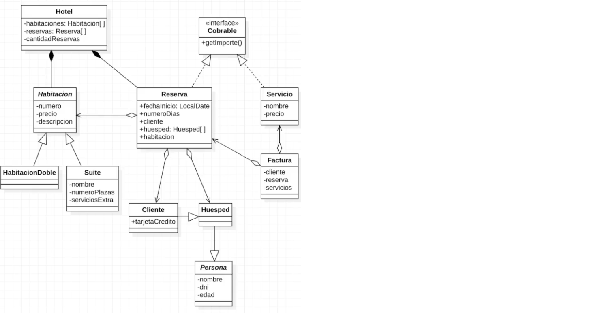
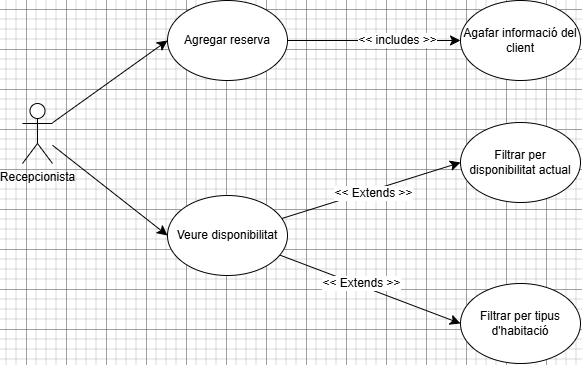

# ProjecteProgramacioTMM-HotelBoutique
L'objectiu d'aquest projecte és representar els coneixements de la RA5 i 7 juntament amb els del curs d'OpenWebinars "Java desde 0: Programación Orientada a Objetos". La part funcional del projecte, és a dir, la idea/plantejament cal dir que ha sigut servida per part del curs d'Open Webinars però el desenvolupament en codi del programa no.

# Descripció del projecte
Es vol desenvolupar una aplicació per a gestionar alguns aspectes d'un petit hotel. Sobretot les tasques que corresponen a les habitacions i reserves.
En principi, l'hotel es petit i té només 10 habitacions de 2 tipus: 8 dobles i 2 suites.

# Descripció del sistema
//Respecte les habitacions:
L'hotel té habitacions que poden tenir reserves. Les habitacions poden ser de dos tipus:
    · Dobles
    · Suites
Les suites tindran més dades que no les dobles.

//Respecte les persones
Al sistema es gestionaran persones que també poden ser de dos tipus:
    · Host
    · Client: Aquest es un subtipus d'host especial, ja que és qui realitza la reserva i posteriorment la paga.

//Respecte els serveis
L'hotel oferirà nous serveis. Tant la reserva com els serveis implementen una interface, cobrable, ja que són les coses que es poden cobrar als clients.
Una factura inclou una reserva, el client a qui es factura i opcionalment, altres serveis gaudits.

# Diagrames
Diagrames de clases:

Diagrames de Casos d'Ús:

